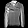

# Proyecto: Fashion MNIST Image Generator
Este proyecto utiliza un modelo basado en DCGAN (Deep Convolutional Generative Adversarial Network) para generar imágenes realistas a partir del conjunto de datos Fashion MNIST. 

Al entrenar al generador y al discriminador, lograremos crear red capaz de crear nuevas imágenes similares a las del dataset original.

## Configuración del entorno virtual
Para evitar instalar las dependencias de forma global en el sistema, se recomienda utilizar un entorno virtual de Python. Sigue estos pasos:

### 1. Crear un entorno virtual, puede cambiar el nombre `gan_env` al que quiera
```bash
python -m venv gan_env
```

### 2. Activar el entorno virtual
- **Windows**:
  ```bash
  gan_env\Scripts\activate
  ```
- **macOS / Linux**:
  ```bash
  source gan_env/bin/activate
  ```

### 3. Instalar las dependencias
Una vez activado el entorno virtual, instala o actualiza las dependencias en caso de ser necesario ejecutando:
```bash
pip install -r requirements.txt
```

### 4. Si desea salir use:
```bash
deactivate
```

Luego, abre el cuaderno correspondiente para trabajar con las GANs y aprender sobre el desarrollo de ésta para el caso de la generación de imágenes y accesorios.

## Modelos entrenados
Para acelerar futuros experimentos, he guardado varios modelos ya entrenados (tardaron alrededor de 11 horas en completarse en mi caso), como:
- [models/discriminador_fashion_100ep_70000img.keras](models/discriminador_fashion_100ep_70000img.keras)

Esto se realiza mediante un par de funciones dentro del cuaderno jupyter, donde hace un guardado del modelo cada 10 épocas, de esta forma podremos dividir y realizar un entrenamiento largo en varios trozos más pequeños.

## Imágenes de ejemplo
También puedes encontrar ejemplos generados en la carpeta [samples_generated](samples_generated). Por ejemplo:




## Referencias
Durante este proyecto se ha consultado recursos y optimizacione del paper oficial publicado en este mismo dataset:

- *Unsupervised Representation Learning with Deep Convolutional Generative Adversarial Networks* by **Alec Radford**, **Luke Metz**, **Soumith Chintala**.
